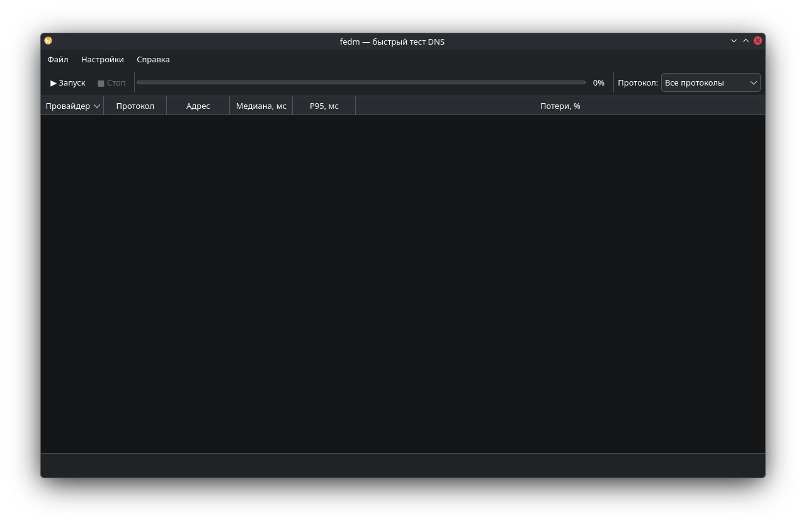

<!-- ███████╗███████╗██████╗ ███╗   ███╗ -->
<!-- ██╔════╝██╔════╝██╔══██╗████╗ ████║ -->
<!-- █████╗  █████╗  ██║  ██║██╔████╔██║ -->
<!-- ██╔══╝  ██╔══╝  ██║  ██║██║╚██╔╝██║ -->
<!-- ██║     ███████╗██████╔╝██║ ╚═╝ ██║ -->
<!-- ╚═╝     ╚══════╝╚═════╝ ╚═╝     ╚═╝ -->

<div align="center">

# fedm

**Честный бенчмарк DNS-резолверов для Linux: plain, DoT, DoH, DoQ**

[](https://github.com/K1egaL/fedm/actions/workflows/ci.yml)
[](https://www.python.org/)
[](https://opensource.org/licenses/MIT)
[](#)
[](https://doc.qt.io/qtforpython/)

<p>
  <a href="#почему-fedm">Почему fedm?</a> •
  <a href="#возможности">Возможности</a> •
  <a href="#установка">Установка</a> •
  <a href="#использование">Использование</a> •
  <a href="#faq">FAQ</a> •
  <a href="#roadmap">Roadmap</a>
</p>



</div>

---

## Почему fedm?

Обычные «DNS-тесты» врут. Они меряют либо пинг до ближайшего anycast-узла, либо скорость из кэша CDN — то есть что угодно, кроме того, что вы хотите знать: **как быстро конкретный резолвер ответит на новый запрос из вашей сети**.

**fedm** генерирует уникальный случайный субдомен для каждого запроса (`a3f9c1d8e2b4.github.com`). Такой домен никто никогда не запрашивал, значит резолвер **обязан** пойти в реальную рекурсию:
root → .com TLD → github.com authoritative → ответ

То, что ответ будет NXDOMAIN, не важно. Мы меряем **реальное время рекурсии**, а не кэш.

- 🎯 **Честный замер.** Cache-busting через случайный субдомен.
- ⚡ **Параллельно.** asyncio: 30+ целей × 9 доменов × 6 итераций ≈ 30 секунд.
- 🔐 **Все современные протоколы.** Plain UDP:53, DoT, DoH, DoQ + ICMP/TCP для сравнения.
- 🐧 **Linux-native.** Qt6, тёмная/светлая тема, интеграция с KDE.

---

## Возможности

- **6 протоколов:** Plain DNS (UDP:53), DoT (TLS:853), DoH (HTTPS), DoQ (QUIC), ICMP ping, TCP connect.
- **9 готовых провайдеров** + свои серверы в любом формате.
- **Свои тестовые домены** — 9 по умолчанию, редактор в UI.
- **Цветовая индикация** скорости: от 🟢 < 30 мс до 🔴 > 300 мс.
- **Выделение победителей** в каждом протоколе (жирным).
- **Фильтр по протоколам** прямо в тулбаре.
- **ПКМ по строке** → копировать IP / DoH / DoQ / адрес.
- **Экспорт:** JSON (`Ctrl+S`), CSV (`Ctrl+Shift+S`), таблица в Markdown одним кликом.
- **Автосортировка** по медиане после теста.
- **Свой конфиг** в `~/.config/fedm/config.json`.

---

## Поддерживаемые протоколы

| Протокол | Порт | Транспорт | RFC | Замечание |
|---|---|---|---|---|
| Plain DNS | 53 | UDP / TCP | [1035](https://datatracker.ietf.org/doc/html/rfc1035) | Классика, не шифрован |
| DoT | 853 | TLS | [7858](https://datatracker.ietf.org/doc/html/rfc7858) | Шифрован, но порт виден |
| DoH | 443 | HTTPS | [8484](https://datatracker.ietf.org/doc/html/rfc8484) | Мимикрирует под веб-трафик |
| DoQ | 853 | QUIC | [9250](https://datatracker.ietf.org/doc/html/rfc9250) | Быстрее DoT, но часто режется |
| ICMP | — | raw socket | — | Только сетевой RTT, не DNS |
| TCP connect | — | TCP | — | Проверка доступности |

---

## Готовые провайдеры

| Провайдер | Plain | DoT | DoH | DoQ | Особенность |
|---|:---:|:---:|:---:|:---:|---|
| **Cloudflare** | 1.1.1.1 | ✅ | ✅ | ✅ | Эталон скорости, anycast |
| **Google** | 8.8.8.8 | ✅ | ✅ | ✅ | Крупнейший public DNS |
| **Quad9** | 9.9.9.9 | ✅ | ✅ | ✅ | Блокирует malware-домены |
| **AdGuard** | 94.140.14.14 | ✅ | ✅ | ✅ | Блокирует рекламу и трекеры |
| **Yandex** | 77.88.8.8 | ✅ | ✅ | — | Быстрый в РФ |
| **Mullvad** | 194.242.2.2 | ✅ | ✅ | ✅ | Приватность, VPN-провайдер |
| **DNS.SB** | 185.222.222.222 | ✅ | ✅ | ✅ | Без логов |
| **OpenDNS** | 208.67.222.222 | ✅ | ✅ | — | Родительский контроль |
| **LibreDNS** | 116.202.176.26 | ✅ | ✅ | — | Open-source, без цензуры |

Плюс — **свои серверы** в формате:
1.1.1.1 # plain UDP:53
tls://dns.example.com # DoT
https://dns.example.com/dns-query # DoH
quic://dns.example.com # DoQ
tcp://host:443 # TCP connect

---

### Установка
**Требуется Python 3.14+.**

Arch Linux / CachyOS
```bash
sudo pacman -S --needed python python-pyside6 python-dnspython \
    python-httpx python-aioquic python-icmplib

git clone https://github.com/K1egaL/fedm.git
cd fedm
python -m fedm
``` 

Debian / Ubuntu / Mint / Pop!_OS
```bash
sudo apt install python3 python3-pip python3-venv git
git clone https://github.com/K1egaL/fedm.git
cd fedm
python3 -m venv .venv
source .venv/bin/activate
pip install -e .
python -m fedm
```

Fedora / RHEL / Nobara

```bash
sudo dnf install python3 python3-pip git
git clone https://github.com/K1egaL/fedm.git
cd fedm
python3 -m venv .venv
source .venv/bin/activate
pip install -e .
python -m fedm
```

openSUSE
```bash
sudo zypper install python3 python3-pip git
git clone https://github.com/K1egaL/fedm.git
cd fedm
python3 -m venv .venv
source .venv/bin/activate
pip install -e .
python -m fedm
```
macOS (экспериментально)
```bash
brew install python@3.14 git
git clone https://github.com/K1egaL/fedm.git
cd fedm
python3 -m venv .venv
source .venv/bin/activate
pip install -e .
python -m fedm
```
Команда fedm в PATH
После pip install -e . внутри активированного venv команда fedm доступна откуда угодно.

Иконка в меню приложений (Linux)
Создай файл ~/.local/share/applications/fedm.desktop, подставив свои абсолютные пути:

```ini
[Desktop Entry]
Version=1.0
Type=Application
Name=fedm
GenericName=DNS Benchmarker
Comment=Быстрый тест DNS-резолверов (plain, DoT, DoH, DoQ)
Exec=/home/USER/fedm/.venv/bin/python -m fedm
Icon=/home/USER/fedm/assets/icon.svg
Terminal=false
Categories=Network;Utility;
StartupWMClass=fedm
Keywords=dns;benchmark;network;speed;fedm;
```
Обнови базу:

```bash
update-desktop-database ~/.local/share/applications/
```
Теперь fedm ищется через меню KDE/GNOME.

ICMP без root
icmplib требует разрешить unprivileged ping:

```bash
sysctl net.ipv4.ping_group_range
```
Если вывод 0 0 — разреши:

```bash
echo 'net.ipv4.ping_group_range = 0 2147483647' | \
    sudo tee /etc/sysctl.d/99-ping.conf
sudo sysctl --system
```
Использование
Настройки → Провайдеры — выбери готовые резолверы.

Настройки → Свои серверы — добавь свои (по одному на строку).

Настройки → Тестовые домены — какие домены проверять (по умолчанию 9).

Жми F5 или ▶ Запуск.

Результаты: цвета и жирный шрифт — победители в каждом протоколе.

ПКМ по строке → копировать IP / DoH / DoQ / адрес / всю таблицу как Markdown.

Ctrl+S — экспорт JSON, Ctrl+Shift+S — CSV.

Формат своих серверов
text

1.1.1.1
1.0.0.1
tls://dns.quad9.net
https://dns.google/dns-query
quic://dns.adguard-dns.com
tcp://1.1.1.1:443

## Под капотом
|Файл |	Что внутри |
|---|---|
| **fedm/bench.py**	| Async-ядро. Все пробы (UDP/DoT/DoH/DoQ/ICMP/TCP), генерация случайных субдоменов, агрегация результатов. |
| **fedm/providers.py**	| Список провайдеров и дефолтных доменов — чистые данные. |
| **fedm/config.py** | Чтение/запись ~/.config/fedm/config.json. |
| **fedm/ui.py**	| PySide6 GUI: модель таблицы, фильтр, ПКМ-меню, экспорт. |
| **fedm/__main__.py**	| Точка входа для python -m fedm. |
| **Ключевая деталь:** | _gather_with_timeout в bench.py гарантирует, что зависшая проба (например, DoQ к заблокированному серверу) не подвесит весь бенч. Она корректно превращается в TimeoutError и идёт в счётчик потерь, а остальные результаты возвращаются нормально. |


## FAQ
<details> <summary><b>Почему у меня DoQ показывает 100% loss?</b></summary>
Скорее всего, ваш провайдер, корпоративный firewall или VPN блокирует UDP:853. Это типично для РФ и многих хостеров.

Что делать:

попробовать без VPN;

переключиться на DoT (порт 853 TCP) или DoH (443);

проверить в терминале: dig +quic @dns.adguard-dns.com example.com.

fedm не падает в этом случае — он честно показывает loss.

</details><details> <summary><b>Почему такие высокие цифры — 600+ мс?</b></summary>
fedm измеряет реальную рекурсию, а не пинг. Когда резолвер никогда раньше не видел <random>.github.com, он идёт по цепочке:

text
root → .com → github.com NS → authoritative
Это и есть настоящая задержка для нового домена. При повторных запросах к тому же домену было бы 5-20 мс (кэш), но это не интересно — вам нужна реальная скорость резолва.

Если хочется «оптимистичных» цифр — используйте dig без рандомизации, там будет кэш.

</details><details> <summary><b>Почему ICMP-пинг не показывает реальную скорость DNS?</b></summary>
ICMP — это сетевой RTT до сервера. Резолвер может быть в 5 мс от вас, но делать DNS-запрос 300 мс из-за медленного апстрима, перегрузки или большой очереди.

fedm меряет именно DNS-ответ, а не пинг до IP. ICMP вкл/выкл отдельной галочкой — как дополнительная метрика.

</details><details> <summary><b>Что лучше: медиана или среднее?</b></summary>
В fedm — медиана. Один выброс (например, потеря UDP-пакета и retry через 1 сек) убивает среднее арифметическое, но почти не влияет на медиану. Плюс показывается P95 — 95-й перцентиль, чтобы видеть «хвосты».

Если сервер медленный только в 5% случаев, P95 это покажет, а медиана — нет.

</details><details> <summary><b>Сколько времени занимает тест?</b></summary>
Формула:

text
время ≈ iterations × domains × per_probe_time
При дефолтных настройках (6 итераций × 9 доменов × 2 сек таймаута) — примерно 30 секунд, если все резолверы живы. Если кто-то молчит — каждый таймаут добавляет свои 2 сек, но параллельно, поэтому общее время почти не растёт.

Хотите быстрее — уменьшите итерации или домены в настройках.

</details><details> <summary><b>Можно ли использовать fedm в скриптах?</b></summary>
Пока нет CLI-режима, но он в roadmap. Пока — экспорт в JSON и парсинг:

``` bash
python -m fedm
```
# запустить тест, потом File → Export JSON
jq '.results | sort_by(.median_ms) | .[0]' ~/fedm-results.json
</details>
Roadmap
☑ Plain DNS, DoT, DoH, DoQ + ICMP/TCP
☑ Cache-busting через случайный субдомен
☑ Цветовая индикация и выделение победителей
☑ Экспорт JSON / CSV / Markdown
☑ Фильтр по протоколам
□ CLI-режим: fedm --providers cloudflare,google --json
□ История замеров с графиком изменений во времени
□ DoH через общий httpx-пул — ускорение теста в 2 раза
□ ECS (EDNS Client Subnet) — для продвинутых сценариев
□ Проверка DNSSEC — валидация цепочки подписи
Хотите что-то добавить — откройте issue.

Star History
https://api.star-history.com/svg?repos=K1egaL/fedm&type=Date

Лицензия
MIT — делайте что хотите, только сохраните копирайт.

Благодарности
dnspython — основа для plain/DoT/DoH

aioquic — DoQ

PySide6 — GUI

icmplib — ICMP

<div align="center">
Сделано с ❤️ и <code>asyncio</code>

</div>